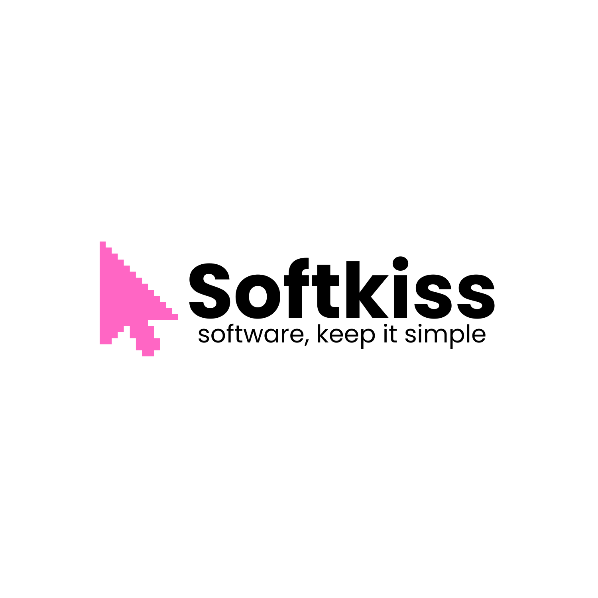

# 💼 Softkiss Business Website

Sitio web corporativo de Softkiss - D## 🎯 Productos

### Suite Empresarial
- [terbiz.app](https://terbiz.app) - ERP / Núcleo empresarial
- [upmet.app](https://upmet.app) - Objetivos y ejecución
- [jurdex.app](https://jurdex.app) - Jurídico y normativo
- [relnet.app](https://relnet.app) - CRM y relaciones
- [sellit.app](https://sellit.app) - E-commerce y ventas en línea

### SK Tools Suite
- [sktools.app](https://sktools.app) - Herramientas de manipulación de documentos, imágenes, video, audio y generador/tracker de QRolladora de Software



## 🚀 Quick Start

### Desarrollo Local

```bash
# Clonar el repositorio
git clone https://github.com/softkissdev/softkiss-bw.git
cd softkiss-bw

# Instalar dependencias
npm install

# Ejecutar en modo desarrollo
npm run dev

# Build para producción
npm run build

# Preview del build
npm run preview
```

## 🌐 Deploy Automático

Este proyecto tiene CI/CD configurado para deploy automático.

### En el Servidor (Solo una vez):

```bash
# 1. Clonar el repo
git clone https://github.com/softkissdev/softkiss-bw.git
cd softkiss-bw
git checkout production

# 2. Ejecutar setup automático
chmod +x setup-server.sh
./setup-server.sh

# 3. Configurar Nginx (opcional)
chmod +x setup-nginx.sh
sudo ./setup-nginx.sh
```

El script `setup-server.sh` te dará los secrets para configurar en GitHub.

### Desde tu Máquina Local:

```bash
# Push a production para deploy automático
git checkout production
git merge main
git push origin production
```

**📖 Documentación completa:** Ver [SETUP.md](./SETUP.md)

## 🛠️ Tech Stack

- **Vue 3** - Framework progresivo
- **Vite** - Build tool
- **GitHub Actions** - CI/CD
- **Nginx** - Servidor web

## �� Productos

- [terbiz.app](https://terbiz.app) - Software comercial
- [jurdex.app](https://jurdex.app) - Soluciones jurídicas
- [focusit.app](https://focusit.app) - Productividad

## 📂 Estructura del Proyecto

```
softkiss-bw/
├── src/
│   ├── components/      # Componentes Vue
│   │   ├── ui/         # Componentes reutilizables
│   │   ├── Hero.vue
│   │   ├── About.vue
│   │   ├── Products.vue
│   │   ├── Contact.vue
│   │   └── Footer.vue
│   ├── App.vue         # Componente principal
│   └── main.js         # Entry point
├── assets/             # Imágenes y recursos
├── .github/workflows/  # CI/CD workflows
├── setup-server.sh     # Setup automático del servidor
├── setup-nginx.sh      # Configuración de Nginx
└── package.json

```

## 🔄 Workflow de Desarrollo

```
development → main → production
    ↓          ↓          ↓
  testing    staging   auto-deploy
```

## 🎨 Diseño

Diseño moderno con tonos pastel claros, enfocado en la experiencia de usuario y optimizado para SEO.

## 📝 Licencia

© 2025 Softkiss. Todos los derechos reservados.

---

**Desarrollado con 💜 por Softkiss**

<!-- Webhook test #2 - Oct 5, 2025 06:35 -->
